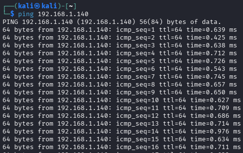
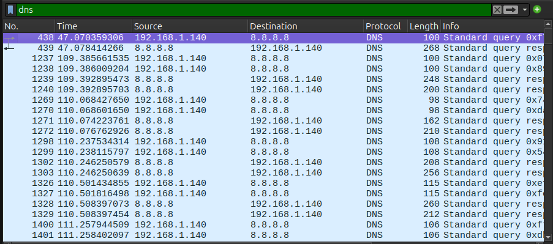
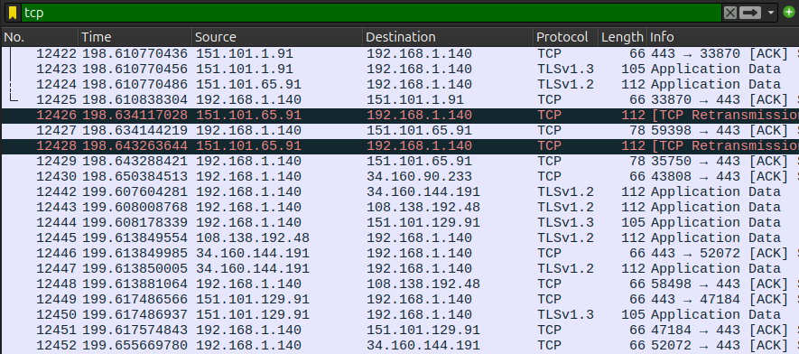
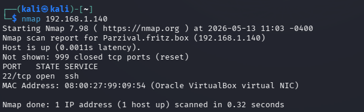
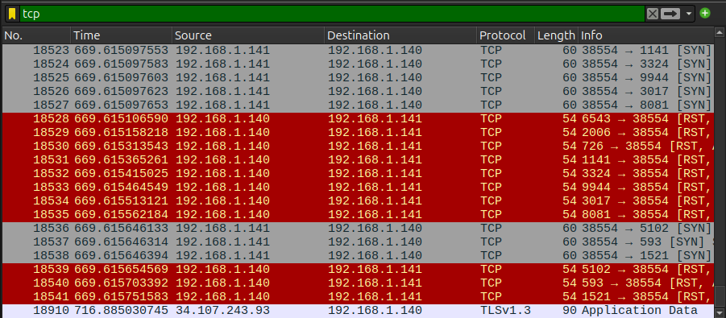
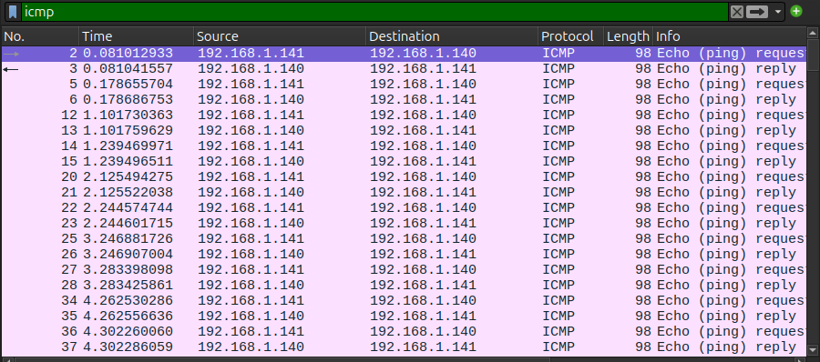

# Network Traffic Analysis & Port Scanning Detection Lab

## Overview

This project demonstrates basic network traffic analysis and reconnaissance detection using Wireshark and Nmap in a virtualized lab environment.

## Objectives

- Analyze ICMP traffic
- Understand DNS requests and responses
- Observe TCP/TLS communication
- Detect port scanning activity
- Practice network traffic analysis in a Linux environment

## Connectivity Test

A ping test was performed between Kali Linux and Ubuntu to verify network communication.

## DNS Traffic Analysis

DNS queries and responses were captured while accessing external websites.

## TCP and TLS Traffic

TCP and TLS traffic was analyzed to observe HTTPS communication and encrypted connections.

## Nmap Port Scan

An Nmap scan was performed from Kali Linux against the Ubuntu target system.

## Port Scan Detection

Wireshark captured multiple TCP SYN packets and RST responses generated during the Nmap scan, demonstrating reconnaissance activity and port enumeration behavior.

## ICMP Traffic Analysis

Wireshark was used to capture ICMP Echo Request and Echo Reply packets generated during the ping test.

## Skills Demonstrated

- Network Traffic Analysis
- Packet Capture
- TCP/IP Fundamentals
- DNS Analysis
- ICMP Analysis
- Port Scanning Detection
- Wireshark Usage
- Nmap Usage
- Linux Networking

