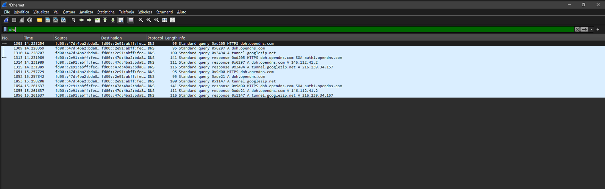

# Network Traffic Analysis Lab

## Objective

Analyze network traffic using Wireshark to identify common network protocols and packet behavior.

## Environment

- Kali Linux
- Wireshark
- VirtualBox

## Protocols Analyzed

- DNS
- TCP
- HTTP
- ICMP

## Activities Performed

- Captured network packets
- Filtered DNS traffic
- Analyzed query and response packets
- Inspected source and destination addresses
- Observed protocol behavior

## Wireshark Filter Used

```text
dns
```

## Screenshots

### DNS Traffic Analysis



## Skills Demonstrated

- Packet Analysis
- Network Traffic Monitoring
- Protocol Analysis
- Wireshark Usage
- DNS Traffic Inspection

## Conclusion

This lab demonstrated how DNS traffic can be captured and analyzed using Wireshark to better understand network communication behavior.

