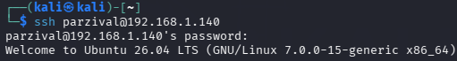
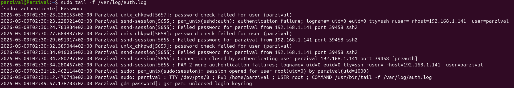

# SSH Brute Force Detection Lab

## Objective

Simulate failed SSH login attempts and analyze Linux authentication logs.

## Environment

- Kali Linux
- Ubuntu Server
- VirtualBox

## Commands Used

```bash
sudo journalctl -u ssh
```

```bash
grep "Failed password" /var/log/auth.log
```

## Attack Simulation

A Kali Linux virtual machine attempted multiple SSH login attempts against an Ubuntu Server virtual machine using invalid credentials.

The authentication failures were generated intentionally to simulate suspicious SSH activity.

## Detection

The failed login attempts were identified through Linux authentication logs using:

```bash
sudo tail -f /var/log/auth.log
```

The logs showed:
- Failed password attempts
- Source IP address
- SSH authentication failures
- Connection closure events

## Network Setup

Attacker Machine:
- Kali Linux
- IP: 192.168.1.141

Target Machine:
- Ubuntu Server
- IP: 192.168.1.140


### Successful SSH Connection



### Authentication Log Analysis



## Skills Demonstrated

- Linux Administration
- SSH Troubleshooting
- Log Analysis
- Threat Detection
- Basic Network Analysis

## Conclusion

This lab demonstrated how failed SSH authentication attempts can be monitored and analyzed through Linux authentication logs in a controlled environment.
